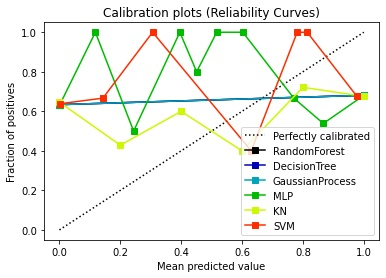
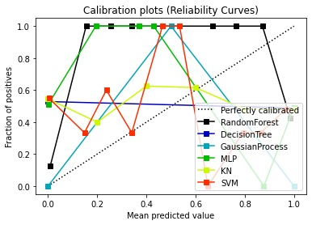
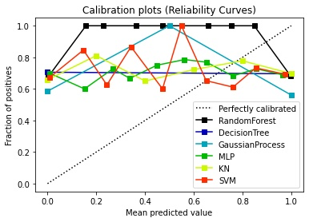

# _Worst case_ MIA properties of common models

This report documents some initial experiments done to establish possible _worst case_ behaviour of a particular target model, dataset combination.

To perform these experiments, we split a dataset into two portions -- _training_ and _testing_. The target model is trained on the _training_ set and then predictive probabilities are obtained for both the _training_ and _testing_ sets.

These predictive probabilities become the input to an _attack_ model that is trained to attempt to determine which of the two sets a data point came from based only on the predictive probabilities.

This is clearly an unrealistic attack model: if the attacker knows which data was and wasn't in the training set they don't need to attack. However, it is hoped that this might give us some idea as to the intrinsic _attackability_ of a model, dataset pair. i.e. if we cannot determine whether objects are from the _training_ or _test_ sets under this scenario, it seems incredibly likely that an attacker without this information would be able to.

For each model, dataset pair, we present the AUC and a ROC curve of the attack model, as well as a plot of the predictive probabilities of the target model (separately for each class) for the training and test data. In addition we show....

## Results with default hyper-parameters

The initial models have been trained with a subset of MIMIC-II data (https://physionet.org/content/mimic2-iaccd/1.0/).

The data is split into 3: target_train (0.5), shadow_train (0.25) and test (0.25). The target_train is used to train the target model, the shadow_train data is for training Salem 1 shadow model and the test data is used to test in all cases. For Salem 2 the breast cancer dataset available from sklearn is used for the subshadow models (0.7 for training and 0.3 for testing).

All membership inference attacks use RandomForest classifier.

- Decision Tree MIA
	- Worst Case

	- Salem1

	- Salem2

- GaussianProcess MIA
	- Worst Case

	- Salem1

	- Salem2

- Decision Tree MIA
	- Worst Case

	- Salem1

	- Salem2

- KN MIA
	- Worst Case

	- Salem1

	- Salem2

- MLP MIA
	- Worst Case

	- Salem1

	- Salem2

- RandonForest MIA
	- Worst Case

	- Salem1

	- Salem2

- SVM MIA
	- Worst Case

	- Salem1

	- Salem2

- Calibration curves
	- Worst case
	
	- Salem 1
	
	- Salem 2
	
Table summarising different metrics. It is sorted by classifiers and then the different scenarios.

| model | scenario | type | TPR | FPR | FAR | TNR | PPV | NPV | FNR | ACC | Advantage | PLR | NLR | OR | AUC |
|----- | -------- | ---- | --- | --- | --- | --- | --- | --- | --- | --- | --------- | --- | --- | -- | --- |
 | DecisionTree | Salem1 | MIA | 1.0 | 1.0 | 0.5047 | 0.0 | 0.4953 | nan | 0.0 | 0.4953 | 0.0 | 1.0 | nan | nan | 0.5 |
 | DecisionTree | Salem1 | shadow | 1.0 | 0.0 | 0.0 | 1.0 | 1.0 | 1.0 | 0.0 | 1.0 | 1.0 | inf | 0.0 | inf | 0.9949 |
 | DecisionTree | Salem2 | MIA | 1.0 | 1.0 | 0.2982 | 0.0 | 0.7018 | nan | 0.0 | 0.7018 | 0.0 | 1.0 | nan | nan | 0.5 |
 | DecisionTree | Salem2 | shadow | 0.9009 | 0.1 | 0.0566 | 0.9 | 0.9434 | 0.8308 | 0.0991 | 0.9006 | 0.8009 | 9.009 | 0.1101 | 81.8182 | 0.9004 |
 | DecisionTree | model | WorstCase | 1.0 | 1.0 | 0.3312 | 0.0 | 0.6688 | nan | 0.0 | 0.6688 | 0.0 | 1.0 | nan | nan | 0.5 |
 | DecisionTree | model | model | 1.0 | 0.0 | 0.0 | 1.0 | 1.0 | 1.0 | 0.0 | 1.0 | 1.0 | inf | 0.0 | inf | 0.9949 |
 | GaussianProcess | Salem1 | MIA | 1.0 | 0.0 | 0.0 | 1.0 | 1.0 | 1.0 | 0.0 | 1.0 | 1.0 | inf | 0.0 | inf | 0.9949 |
 | GaussianProcess | Salem1 | shadow | 0.0 | 0.0 | nan | 1.0 | nan | 0.3158 | 1.0 | 0.3158 | 0.0 | nan | 1.0 | nan | 0.5 |
 | GaussianProcess | Salem2 | MIA | 1.0 | 0.0 | 0.0 | 1.0 | 1.0 | 1.0 | 0.0 | 1.0 | 1.0 | inf | 0.0 | inf | 0.9949 |
 | GaussianProcess | Salem2 | shadow | 0.9459 | 0.1 | 0.0541 | 0.9 | 0.9459 | 0.9 | 0.0541 | 0.9298 | 0.8459 | 9.4595 | 0.0601 | 157.5 | 0.5713 |
 | GaussianProcess | model | WorstCase | 1.0 | 1.0 | 0.3312 | 0.0 | 0.6688 | nan | 0.0 | 0.6688 | 0.0 | 1.0 | nan | nan | 0.5 |
 | GaussianProcess | model | model | 1.0 | 0.0 | 0.0 | 1.0 | 1.0 | 1.0 | 0.0 | 1.0 | 1.0 | inf | 0.0 | inf | 0.9949 |
 | KN | Salem1 | MIA | 0.1296 | 0.1321 | 0.5 | 0.8679 | 0.5 | 0.4946 | 0.8704 | 0.4953 | 0.0024 | 0.9815 | 1.0028 | 0.9787 | 0.5072 |
 | KN | Salem1 | shadow | 0.978 | 0.1667 | 0.0729 | 0.8333 | 0.9271 | 0.9459 | 0.022 | 0.9323 | 0.8114 | 5.8681 | 0.0264 | 222.5 | 0.9531 |
 | KN | Salem2 | MIA | 1.0 | 1.0 | 0.2982 | 0.0 | 0.7018 | nan | 0.0 | 0.7018 | 0.0 | 1.0 | nan | nan | 0.4871 |
 | KN | Salem2 | shadow | 0.964 | 0.1667 | 0.0855 | 0.8333 | 0.9145 | 0.9259 | 0.036 | 0.9181 | 0.7973 | 5.7838 | 0.0432 | 133.75 | 0.9473 |
 | KN | model | WorstCase | 1.0 | 1.0 | 0.3312 | 0.0 | 0.6688 | nan | 0.0 | 0.6688 | 0.0 | 1.0 | nan | nan | 0.4852 |
 | KN | model | model | 0.989 | 0.1071 | 0.0476 | 0.8929 | 0.9524 | 0.974 | 0.011 | 0.9586 | 0.8819 | 9.2308 | 0.0123 | 750.0 | 0.9903 |
 | MLP | Salem1 | MIA | 0.1132 | 0.1852 | 0.625 | 0.8148 | 0.375 | 0.4835 | 0.8868 | 0.4673 | 0.072 | 0.6113 | 1.0883 | 0.5617 | 0.4655 |
 | MLP | Salem1 | shadow | 0.967 | 0.0476 | 0.0222 | 0.9524 | 0.9778 | 0.9302 | 0.033 | 0.9624 | 0.9194 | 20.3077 | 0.0346 | 586.6667 | 0.9806 |
 | MLP | Salem2 | MIA | 0.675 | 0.6471 | 0.2895 | 0.3529 | 0.7105 | 0.3158 | 0.325 | 0.5789 | 0.0279 | 1.0432 | 0.9208 | 1.1329 | 0.4954 |
 | MLP | Salem2 | shadow | 0.991 | 0.1333 | 0.0678 | 0.8667 | 0.9322 | 0.9811 | 0.009 | 0.9474 | 0.8577 | 7.4324 | 0.0104 | 715.0 | 0.9853 |
 | MLP | model | WorstCase | 0.9159 | 0.9811 | 0.3467 | 0.0189 | 0.6533 | 0.1 | 0.0841 | 0.6188 | 0.0652 | 0.9335 | 4.4579 | 0.2094 | 0.3778 |
 | MLP | model | model | 1.0 | 0.0 | 0.0 | 1.0 | 1.0 | 1.0 | 0.0 | 1.0 | 1.0 | inf | 0.0 | inf | 0.9949 |
 | RandomForest | Salem1 | MIA | 1.0 | 0.0741 | 0.0702 | 0.9259 | 0.9298 | 1.0 | 0.0 | 0.9626 | 0.9259 | 13.5 | 0.0 | inf | 0.9628 |
 | RandomForest | Salem1 | shadow | 1.0 | 0.0 | 0.0 | 1.0 | 1.0 | 1.0 | 0.0 | 1.0 | 1.0 | inf | 0.0 | inf | 0.9949 |
 | RandomForest | Salem2 | MIA | 1.0 | 0.4706 | 0.1667 | 0.5294 | 0.8333 | 1.0 | 0.0 | 0.8596 | 0.5294 | 2.125 | 0.0 | inf | 0.7647 |
 | RandomForest | Salem2 | shadow | 0.964 | 0.0333 | 0.0183 | 0.9667 | 0.9817 | 0.9355 | 0.036 | 0.9649 | 0.9306 | 28.9189 | 0.0373 | 775.75 | 0.9859 |
 | RandomForest | model | WorstCase | 1.0 | 1.0 | 0.3312 | 0.0 | 0.6688 | nan | 0.0 | 0.6688 | 0.0 | 1.0 | nan | nan | 0.5 |
 | RandomForest | model | model | 1.0 | 0.0 | 0.0 | 1.0 | 1.0 | 1.0 | 0.0 | 1.0 | 1.0 | inf | 0.0 | inf | 0.9949 |
 | SVM | Salem1 | MIA | 0.4717 | 0.463 | 0.5 | 0.537 | 0.5 | 0.5088 | 0.5283 | 0.5047 | 0.0087 | 1.0189 | 0.9837 | 1.0357 | 0.5942 |
 | SVM | Salem1 | shadow | 0.978 | 0.1548 | 0.0681 | 0.8452 | 0.9319 | 0.9467 | 0.022 | 0.9361 | 0.8233 | 6.3195 | 0.026 | 243.0385 | 0.9874 |
 | SVM | Salem2 | MIA | 0.6625 | 0.5882 | 0.274 | 0.4118 | 0.726 | 0.3415 | 0.3375 | 0.5877 | 0.0743 | 1.1262 | 0.8196 | 1.3741 | 0.5005 |
 | SVM | Salem2 | shadow | 0.991 | 0.2333 | 0.1129 | 0.7667 | 0.8871 | 0.9787 | 0.009 | 0.9123 | 0.7577 | 4.2471 | 0.0118 | 361.4286 | 0.968 |
 | SVM | model | WorstCase | 0.729 | 0.9811 | 0.4 | 0.0189 | 0.6 | 0.0333 | 0.271 | 0.4938 | 0.2522 | 0.743 | 14.3645 | 0.0517 | 0.2247 |
 | SVM | model | model | 1.0 | 0.119 | 0.0521 | 0.881 | 0.9479 | 1.0 | 0.0 | 0.9624 | 0.881 | 8.4 | 0.0 | inf | 0.9949 |

## Small hyper-parameter changes can make models highly disclosive
