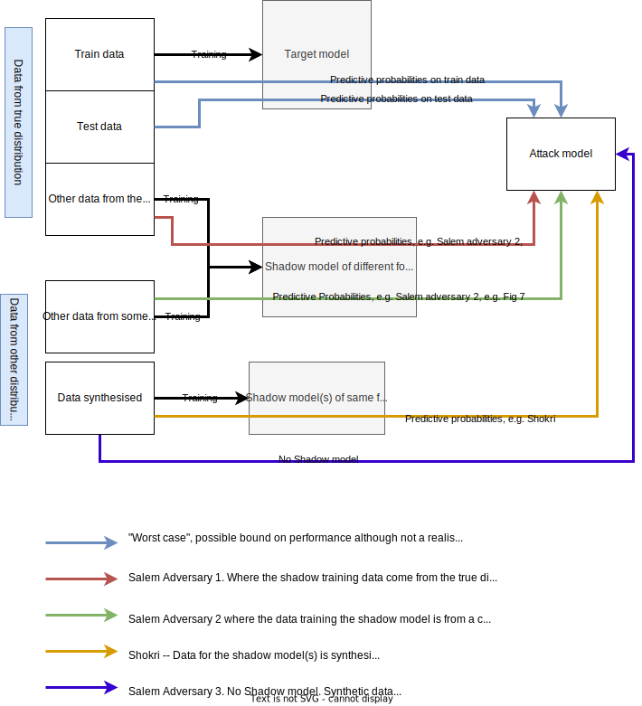

# Attack types

## Introduction

This document summarises the different attack types that we are considering. The hope is that it will form a shared understanding of the different modes of attack and a shared vocabulary.

## Definitions

**Membership Inference Attack**: a form of attack in which the attacker has a data object and they wish to determine whether or not that data object was part of the training set.

**Target Model**: the machine learning model that has been trained within the TRE and that researchers want to release. The model can be queried by presenting values to the inputs and observing the predictions that it makes. Attackers can also look within the model object to potentially see the parameters of the model, its architecture and, for example, how it was optimised. The target model will be trained on data observations (health parameters for indiviuals etc, or images)

**Attack Model**: the model that the attacker will use to determine if, for example, the data example they have is part of the training set or not (for MIA). Attack models are typically not trained on health parameters, but trained on the _probabilities_ obtained when the data object is passed through a predictive model.

**Shadow Model**: attackers will sometimes train _shadow_ models, that in some sense emulate the target model as part of their attack. More details below.

# Black box attacks

Black box in the sense that none of these attacks need access to the internals of the model.

These attacks are represented schematically in this (rough) diagram:

## The _Worst Case_ (maybe) attack

This scenario is presented as a potential worst case that may help elucidate the attackability of a model. It is not intended as a realistic attack scenario. However, it is easy to implement and therefore might be beneficial with TREs to assess models.

This is the scenario used in [Rezaei](https://openaccess.thecvf.com/content/CVPR2021/papers/Rezaei_On_the_Difficulty_of_Membership_Inference_Attacks_CVPR_2021_paper.pdf). They claim that it is the scenario that makes things as easy as possible for the attacker.

### How it works

The attacker has _white box_ access to the target model. The attacker also has access to the data used to train the model and a second dataset from the same distribution (e.g. the original data is split into training and test portions and the attacker has access to both).

There is no shadow model in this attack (it is not required).

The attacker first presents both data sets to the trained target model and records the predictive probabilities obtained for each observation. These probabilities become the data to _train_ the attack model. The attack model does not need to be of the same type as the target model -- any binary classification model can be used. The target value for each attack model training example is 1 or 0 depending on whether or not the example was from the target model training data, or not. The attack model is trained on this data.

To use this model for risk assessment a further data partition is made to split the attack model input data into train and test partitions. The attack model is trained on the train partition and then assessed on the test partition to obtain, for example, the attack AUC, and various other metrics.

## The Shokri Attack

This is the attack format presented in the original Shokri paper, in which Membership Inference Attacks are first defined.

### How it works

The attacker knows the structure of the target model (i.e. what type of model it is, and perhaps hyper-parameters). The attacker does not have access to the exact training data. The attacker builds a number of shadow models. Each shadow model is an estimate of the target model (i.e. they are trained to perform the same task as the target model). Because the attacker doesn't have access to the actual training data, they have to synthesise data to train the shadow models.

Each shadow model can then be presented with the data that trained it, and data that didn't, to generate the predictive probabilities that can be used to train an attack model.

Shokri presents several methods for the creation of this synthetic data for training shadow models.

## Salem scenario 1

Salem's first scenario sits somewhere inbetween _Worst Case_ and Shokri. It is assumed that the attacker doesn't have access to the training data, but has access to other data from the same distribution. This can be simulated by partitioning the data at source. The attacker is assumed to _not_ have access to knowledge about the target model's structure and creates only one shadow model.

### How does it work?

In Salem's attack, the attacker trains a single shadow model on data from the same distribution as that used to train the target model. Predictions from this shadow model for data that was and wasn't used to train it are used to train the attack model.

Salem shows that it isn't necessary for the shadow model to have the same form as the target model -- they demonstrate that attacks are still possible if the shadow model is from a different family as the target model.

## Salem scenario 2

In Salem's second scenario, the restriction that the shadow model training data comes from the same distribution as the data used to train the taret model is also lifted. i.e. the attacker has neither training data from the real distrubition nor knowledge of the target model structure. Salem use completely different datasets to train the shadow model. This is markedly different to Shorkri who, when faced with not having data from the same distribution as that used to train the target model attempted to synthesise something similar. Salem show that shadow models trained on different data completely can provide predictions that allow successful attack models to be trained.

## Salem scenario 3

In Salem's third scenario, the attacker does not bother with an attack model at all. The observations for which the attacker wants to perfom the MI are passed throught the target point and the highest class probability for each one is compared against a threshold to predict whether or not it belonged to the training set or not (above threshold = in training set).

### How it works

The key challenge in this approach is determining the threshold. The authors propose to do this by computing a null distribution: they generate (fairly random) examples that are passed through the models and the highest probability in each case is observed. They make the claim that these values form a reasonable null distribution and therefore setting the threshold at the value corresponding to the top $t$ th percentile is sensible. In their experiments a value of $t=10$ works well.

# Attack metrics

When performing experiments to assess the vulnerability of a (model, dataset) pair to attack, it is possible to compute multiple different output metrics that describe the success (or otherwise) of the attack.

Attack performance metrics measure the ability of the _attack model_ to determine whether or not a particular example was part of the training set or not. The following metrics have all been used in this area:

## Area Under the ROC curve (AUC)

Standard classification metric that computes the area under the curve defined by the complementary specificity (x-axis) and the sensitivity (y-axis). An intuitive description in this domain is to imagine an attacker with two random examples. Unknown to them, one of the examples was in the training set, the other wasn't. Assume the attack model provides a score (e.g. a probability) for each of these two examples having been in the training set. The AUC tells us the probability that the score given for the one that _was_ in the training set will be higher than the score for the one that wasn't. An AUC of 1 therefore means that all positive test examples will have a higher score than all negative ones. An AUC of 0.5 suggests that he classifier is guessing randomly.

## Accuracy

Simply the proportion of test examples that the attack model classifies correctly.

## True Positive Rate

Consider all of the examples presented to the attack model for classification. Each example can be assigned to one of four categories:

1. True Positive (TP): example was in the training set and the classifier predicts it was in the training set
1. True Negative (TN): example was not in the training set and the classifier predicts that it was not in the training set
1. False Positive (FP): example was not in the training set but the classifier predicts it was
1. False Negative (FN): example was in the training set but the classifier predicts it wasn't

The true positive rate, also known as the _sensitivity_ is computed as TP / (TP + FN)  which can be interpreted as the proportion of examples that were in the training set that were correctly classified.

## True Negative Rate

Using the definitions above, the TNR is defined as TN / (TN + FP) which can be interpreted as the proportion of examples that were not in the training set that were correctly classified. Also known as the _specificity_.

## False Positive Rate

FPR is defined as FP / (FP + TN) (also known as the complementary specificity) and can be interpreted as the proportion of examples that were not in the training set that were incorrectly classified.

## False Alarm Rate

FAR is defined as FP / (FP + TP) which can be interpreted as the proportion of things classified as being in the training set that were wrong (i.e. not in).

## Advantage

The classifier advantage is defined as ... TODO